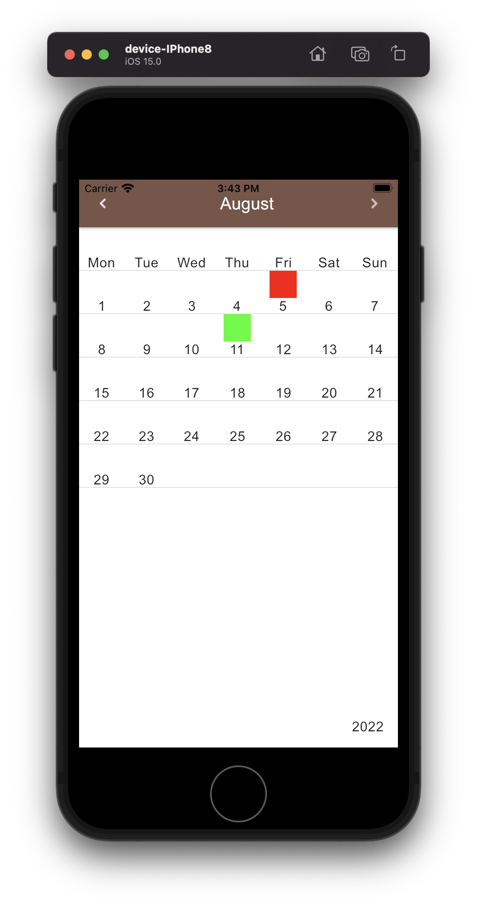
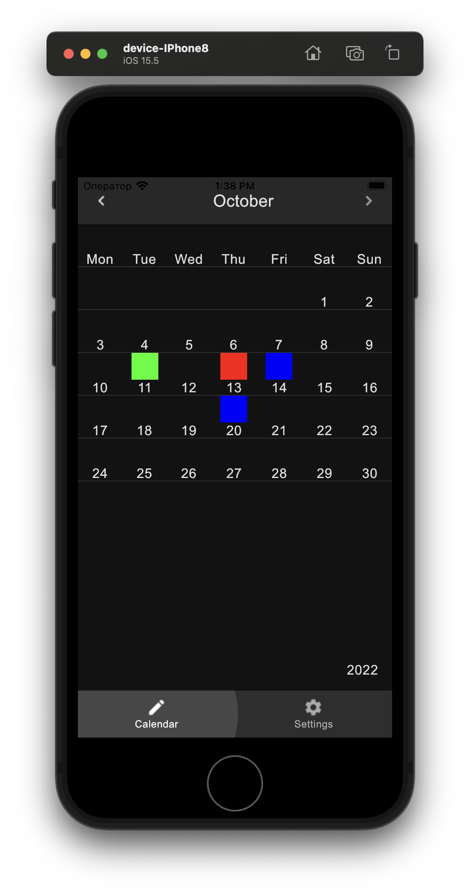
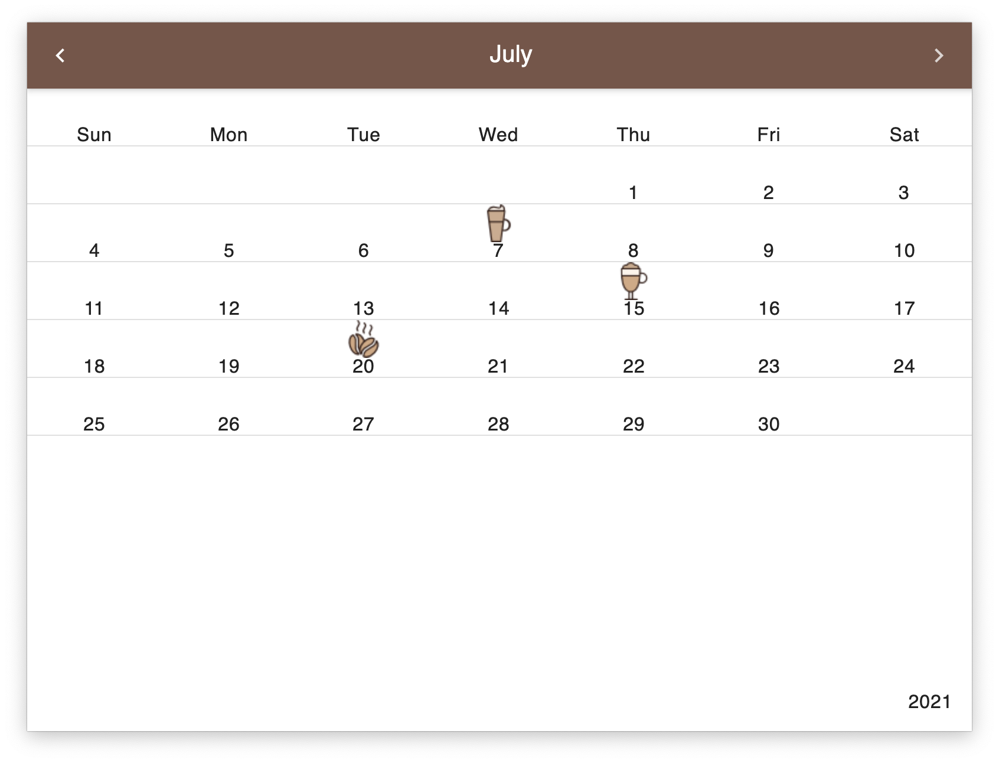

#  Coffeegram Multiplatform

Android + Desktop + iOS (!!!) multiplatform app using [Jetbrains Compose](https://github.com/JetBrains/compose-jb) together with StateFlow and MVI

iOS currently not works with image assets - therefore icons were replaced with color boxes
This project evolved from [Coffeegram Android](https://github.com/phansier/Coffeegram) (with Andorid Jetpack Compose) repository.

## Run on Desktop jvm
`./gradlew run`

## Run on iOS simulator
`./gradlew iosDeployIPhone8Debug --no-configuration-cache`
`./gradlew iosDeployIPadDebug --no-configuration-cache`
