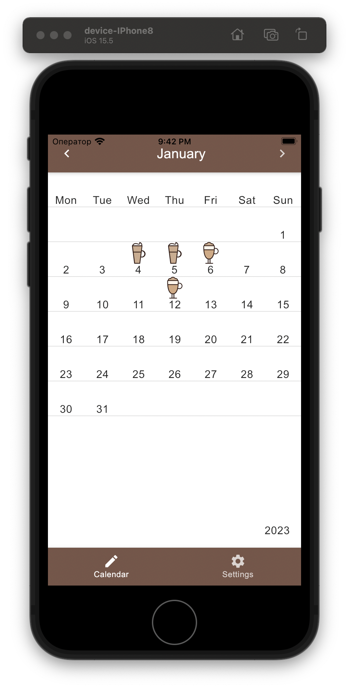
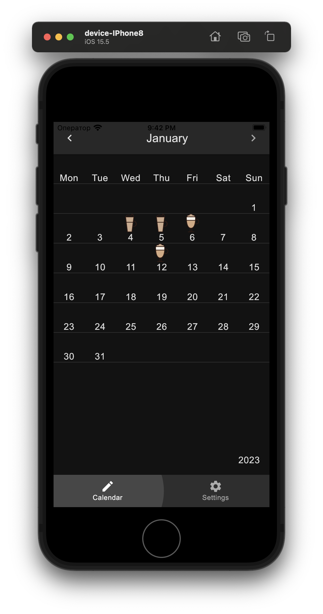

#  Coffeegram on Compose Multiplatform

Android + Desktop + iOS (!!!) multiplatform app using [Compose Multiplatform](https://github.com/JetBrains/compose-jb) together with StateFlow and MVI

This project evolved from [Coffeegram Android](https://github.com/phansier/Coffeegram) (with Android Jetpack Compose) repository.

## Run on Desktop jvm
`./gradlew run`

## Run on iOS
[Using KMM plugin](https://github.com/JetBrains/compose-multiplatform-ios-android-template#on-ios)
